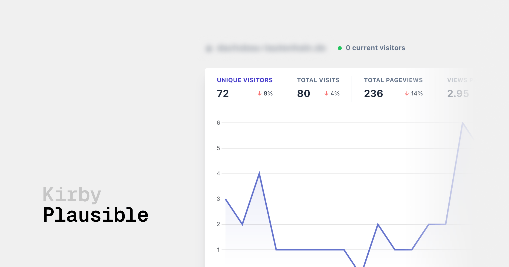

# Kirby Plausible

> [!INFO]
> This is a refactored version of [floriankarsten/kirby-plausible](https://github.com/floriankarsten/kirby-plausible).

This plugin integrates a [Plausible](https://plausible.io) analytics dashboard directly into your Kirby Panel.

## Key Features

- ⚡️ `.env` support when [kirby-helpers](https://github.com/johannschopplich/kirby-helpers) is installed

## Requirements

> [!NOTE]
> The current version of this plugin requires Kirby 4 or higher. For Kirby 3 support, please use version 0.3 of Kirby Plausible.

## Installation

### Composer

```bash
composer require johannschopplich/kirby-plausible
```

### Download

Download and copy this repository to `/site/plugins/kirby-plausible`.

## Usage

1. Create a [Plausible shared link](https://plausible.io/docs/shared-links)
2. Set the `johannschopplich.plausible.sharedLink` in your `config.php`

```php
// config.php
return [
    'johannschopplich.plausible' => [
        'sharedLink' => '<your-plausible-shared-link>',
        // Only needed if the frontend URL differs from the index URL of the Kirby instance
        'domain' => '<your-frontend-domain>'
    ]
];
```

### Dotenv Support

You can use the `PLAUSIBLE_SHARED_LINK` environment variable instead of setting the `johannschopplich.plausible.sharedLink` in your `config.php`.

```ini
PLAUSIBLE_SHARED_LINK=<your-plausible-shared-link>
```

### Frontend Snippet

You can use the included snippet. Add it to the `<head>` tag preferably. The script will not be injected in debug mode.

```php
<?php snippet('plausible') ?>
```

## License

[MIT](./LICENSE) License © 2022-PRESENT [Johann Schopplich](https://github.com/johannschopplich)

[MIT](./LICENSE) License © 2021 [Florian Karsten](https://github.com/floriankarsten)
